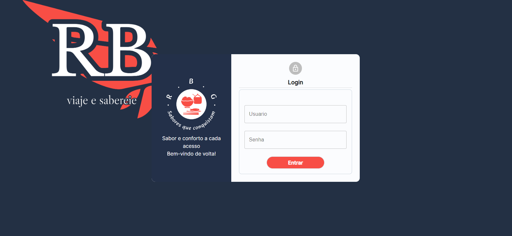
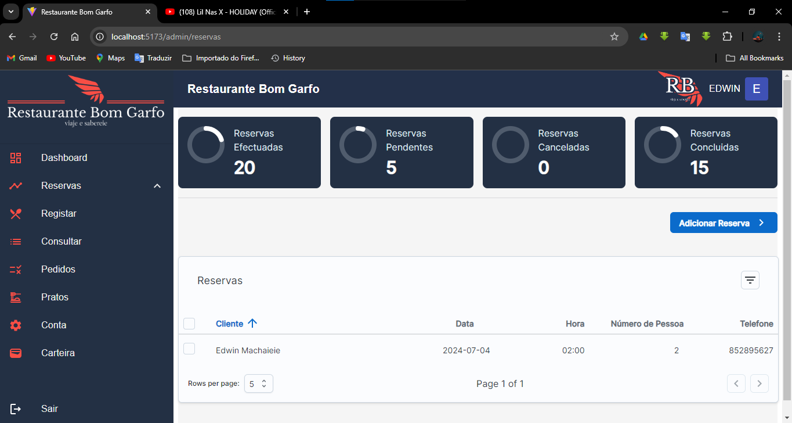
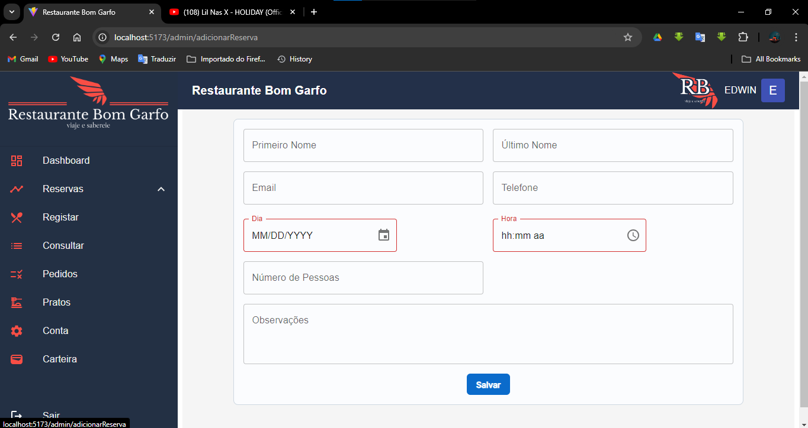
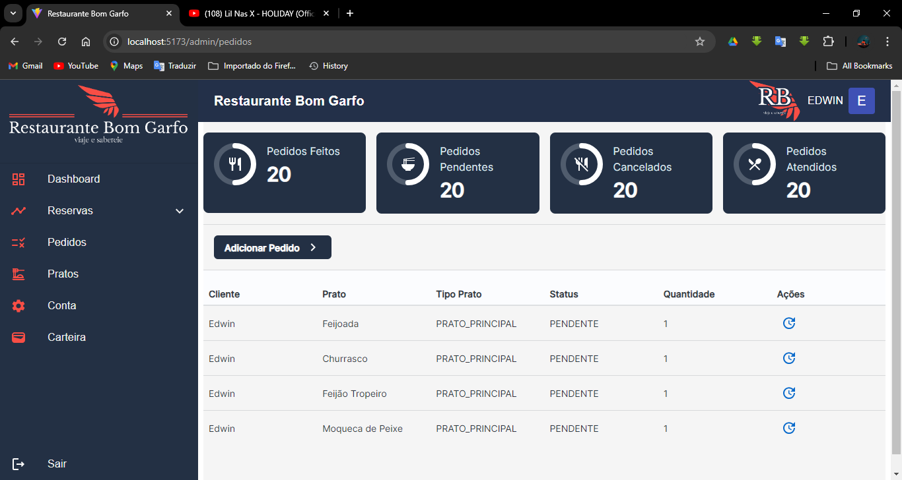

# Restaurant Management System

## Overview

The Restaurant Management System is a comprehensive application designed to streamline the operations of a restaurant. It offers a variety of functionalities, including making and verifying reservations, managing orders, and handling payments through multiple methods. The system is built using modern web technologies to ensure a smooth and efficient user experience.

## Features

### Reservations
- **Make a Reservation:** Customers can easily book a table by providing their details and preferred time.
- **Check Existing Reservations:** View all reservations that have been made, ensuring no double bookings.
- **Cancel Reservations:** Reservations can be canceled if necessary, freeing up space for other customers.

### Orders
- **Register Orders:** Add new orders to the system, specifying the dishes and quantities.
- **Verify Orders:** Check the status and details of existing orders.
- **Cancel Orders:** Orders can be canceled if needed, ensuring flexibility in restaurant operations.

### Financial Management
- **View Balance:** Check the total sales of the restaurant in real-time, giving a clear picture of financial performance.
- **Payment Methods:** The system supports various payment options, including:
  - M-Pesa
  - E-Mola
  - Mobile-account
  - Card payments

## Technologies Used

### Frontend
- **React.js:** A JavaScript library for building user interfaces, ensuring a dynamic and responsive experience.
- **Material UI:** A popular React UI framework that provides a set of reusable components for building modern and intuitive interfaces.

### Backend
- **Java Spring Boot:** A framework for building RESTful web services, providing a robust and scalable backend solution.
- **MySQL:** A relational database management system used for storing and managing data.

### Other Technologies
- **JWT Authentication:** Securely authenticate users and protect endpoints.
- **Axios:** Handle HTTP requests from the frontend to the backend.
- **Formik and Yup:** Manage and validate forms effectively.
- **Redux:** Manage the application state in a predictable way.
- **react-toastify:** A React library that allows for easy toast notifications, used for displaying alerts and messages to the user.
- **react-spinners:** A collection of loading spinner components for React, used to indicate loading states within the application.

## Installation and Setup

### Prerequisites
- Node.js and npm installed
- Java Development Kit (JDK) installed
- MySQL server installed and running

### Frontend
1. Clone the repository:
   ```bash
   git clone (https://github.com/Machaieie/System_Restaurant_Good_Fork).git
   cd restaurant-management-system/frontend
   ```
2. Install dependencies:
   ```bash
   npm install
   ```
3. Start the development server:
   ```bash
   npm run dev
   ```

### Backend
1. clone t the backend repository:
   ```bash
   git clone https://github.com/Machaieie/Restaurante-Bom-Garfo-Core.git
   ```
2. Install dependencies and build the project:
   ```bash
   ./mvnw clean install
   ```
3. Run the Spring Boot application:
   ```bash
   ./mvnw spring-boot:run
   ```

### Database
1. Create a MySQL database:
   ```sql
   CREATE DATABASE restaurant_management;
   ```
2. Update the `application.properties` file with your MySQL credentials:
   ```properties
   spring.datasource.url=jdbc:mysql://localhost:3306/restaurant_management
   spring.datasource.username=yourusername
   spring.datasource.password=yourpassword
   ```

## Usage

1. Open your browser and navigate to `(http://localhost:5173/)` to access the frontend.
2. Use the application to manage reservations, orders, and payments as described in the features section.

## Contribution

Contributions are welcome! Please fork the repository and create a pull request with your changes.

## Contact

For any queries or support, feel free to [Chat with me on WhatsApp](https://wa.me/258852895627).

Follow me on Instagram: [Edwin Machaieie](https://www.instagram.com/edwin_machaieie/).


## Screens 

1. 
2. 
3. 
4. 


